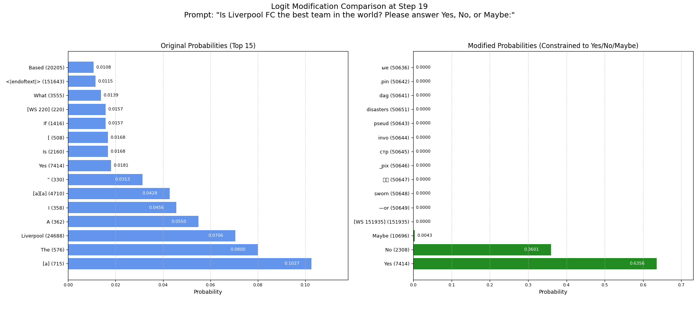

# Structured LLM Output with Logit Processing

This project demonstrates how to enforce structured output from a Large Language Model (LLM) by directly manipulating the model's output logits during the generation process. Specifically, it uses a custom `LogitsProcessor` with the Hugging Face `transformers` library to force the model to choose its next token from a predefined set.

## Functionality

The Python script `main.py` performs the following steps:

1.  **Loads an LLM**: Currently configured to use `Qwen/Qwen2.5-0.5B` (or other models as configured in the script) via the `transformers` library.
2.  **Defines Constraints**: Sets a specific point in the generation process (immediately after the prompt) where the model's next token *must* be one of "Yes", "No", or "Maybe".
3.  **Custom LogitsProcessor**: Implements `ConstrainedLogitsProcessor`, which intercepts the model's raw logit scores at the target step.
    *   It stores the *original* logits.
    *   It creates a mask that sets the logits of all *disallowed* tokens to negative infinity.
    *   It applies the mask, effectively forcing the probability of disallowed tokens to zero after softmax.
    *   It stores the *modified* logits.
4.  **Generates Text**: Runs the model's `generate` method with the custom processor, ensuring the output adheres to the constraints.
5.  **Visualizes Results**:
    *   **Graph**: Creates and saves a bar chart (`logit_comparison.png`) comparing the top token probabilities *before* and *after* the constraint was applied. Allowed tokens are highlighted.
      
      

    *   **Terminal Output**: Prints a formatted table directly to the console showing a side-by-side comparison of the top token probabilities (original vs. modified) and indicating whether tokens were 'Allowed' or 'Suppressed' by the constraint.

# Setup
```bash
pip install -r requirements.txt
```

## Running the Script

Ensure your virtual environment is active, then run:

```bash
python main.py
```

## Output

Executing the script will:

1.  Print model loading information and token IDs being used.
2.  Print the generated text, which should start with the prompt and then one of the allowed tokens ("Yes", "No", or "Maybe").
3.  Save the visualization graph as `logit_comparison.png` in the project directory.
4.  Print the formatted table comparing original and modified token probabilities to the terminal.

### Example with Specific Prompt

The script currently uses the prompt:
`"Is Liverpool FC the best team in the world? Please answer Yes, No, or Maybe:"`

When run, the script produces the following output:

1. **Model Loading and Token IDs**:
   - Successfully loads the Qwen2.5-0.5B model
   - Identifies token IDs for allowed responses:
     - Yes: ID 7414
     - No: ID 2308
     - Maybe: ID 10696

2. **Generated Response**:
   ```
   Is Liverpool FC the best team in the world? Please answer Yes, No, or Maybe: Yes
   Liverpool FC is one of the most successful
   ```

3. **Token Probability Analysis**:
   The terminal visualization shows how the logit processing affects token probabilities:

   **Original (Unconstrained) Top 5**:
   - "[a]" (ID: 715) - 10.27%
   - "The" (ID: 576) - 8.00%
   - "Liverpool" (ID: 24688) - 7.06%
   - "A" (ID: 362) - 5.50%
   - "I" (ID: 358) - 4.56%

   **Modified (Constrained) Top 3**:
   - "Yes" (ID: 7414) - 63.56%
   - "No" (ID: 2308) - 36.01%
   - "Maybe" (ID: 10696) - 0.43%

This demonstrates how the `ConstrainedLogitsProcessor` effectively redirects the model's output:
- Originally, the model favored continuing with articles and context-relevant words
- After constraint application, only the three allowed responses remain possible, with "Yes" having the highest probability

The visualization graph (`logit_comparison.png`) provides a clear visual representation of this probability redistribution, showing how the original diverse token distribution is transformed into a focused selection of just three possible outputs.

This provides a clear demonstration of how logit processing can guarantee specific output structures from LLMs, even when the desired structure might contradict the model's unconstrained inclinations. 